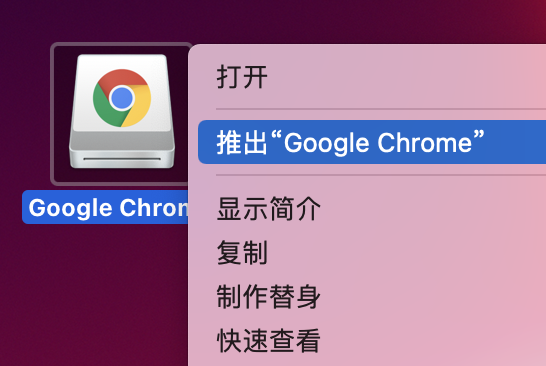
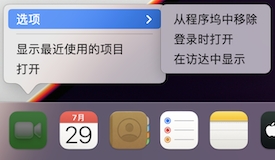
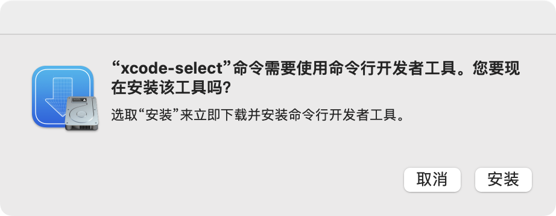
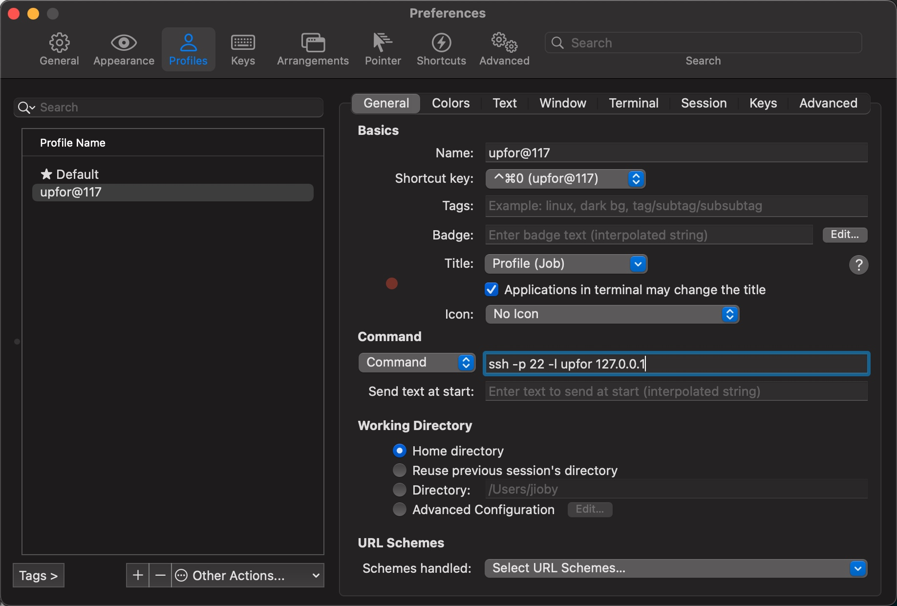
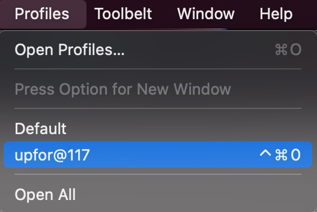

# Mac 开光指南
> 一份新 macOS 快速食用方法，普适新 Mac 或重装系统。
>
> 本文基于 MBP 14寸（2021）12.3 系统和 MBP 13寸（2014）11.4 系统。
> 
> 系统和软件的更新，部分内容可能没有及时更新，故操作界面或步骤会略有差别，但影响不大。
> 
> 长期更新地址: https://github.com/shockerli/mac-initialize


## 应用安装
### 安装软件

### 软件下载途径
- App Store 搜索或排行榜
- 软件的官网，都会提供下载
- 第三方网站（不一定安全，需自行甄别）

有一些软件，是没有上架应用商店（如搜狗输入法）、或应用商店里的是阉割版本（如柠檬清理），就需要去官网下载。

### 桌面上的安装包图标怎么去除？
- 方法①：桌面上右键安装包图标，选择「推出“XXX”」。


- 方法②：Finder（访达）左栏的「位置」处也有对应安装包，点按应用名称右侧的推出图标即可。

- 方法③：重启系统后，安装包镜像会自动取消，对应的图标也会自动消失。


## 键盘符号与快捷键
### 符号映射
| 按键 | 符号 |
| --- | --- |
| Command（Cmd） | ⌘ |
| Shift | ⇧ |
| Option（Alt） | ⌥ |
| Control（Ctrl） | ^ |
| Caps Lock | ⇪ |


### 常用快捷键
大部分情况下，Command 键等同于 Windows 的 Ctrl 键，以下仅列出部分常用或与 Windows 不一样的快捷键，更多参考官方 [Mac 键盘快捷键](https://support.apple.com/zh-cn/HT201236) 以及对应软件的快捷键。

- **Command-Z**：撤销，Shift-Command-Z：重做
- **Command-Tab**：在多个打开的 App 之间切换到下一个最近使用的 App
- **Command-逗号 (,)**：打开最前面的应用的偏好设置
- **Control-Command-Q**：立即锁定屏幕
- **Command-D**：复制所选文件
- **Option-Command-D**：显示或隐藏“程序坞”
- **Command–上箭头**：打开包含当前文件夹的文件夹
- **Command–左中括号 ([)**：前往上一文件夹
- **Command–右中括号 (])**：前往下一个文件夹
- **Command-Delete**：将所选项移到废纸篓
- **Control–下箭头**：显示最前面的应用的所有窗口
- **Control-Command-D**：显示或隐藏所选字词的定义
- **Control–A**：移至行或段落的开头
- **Control–E**：移至行或段落的末尾
- **Control-空格**：切换输入法

其他快捷键：选取苹果菜单 > “系统偏好设置”，点按“键盘”，然后点按“快捷键”。


## 基础设施

### 触摸板设置
触控板的设置及使用教程，可查看 `系统偏好设置 > 触控板`。

> 让你的触摸板变的跟鼠标不同，治疗你的手指关节炎😄

- `系统偏好设置 > 触控板 > 光标与点按`
    * `轻点来点按（勾选）`
    * <u>可单指轻点=鼠标左键点击，可双指轻点=鼠标右键点击</u>

- `系统偏好设置 > 触控板 > 更多手势`
    * `App Expose（勾选）`
    * `在全屏幕显示的App之间轻扫（四指左右轻扫）`
    * <u>以上两个选项，将三指操作改为四指操作，是为了给「三指拖移」让路</u>

- `系统偏好设置 > 辅助功能 > 指针控制 > 鼠标与触控板 > 触控板选项`
    * `启动拖移（勾选）> 三指拖移`
    * <u>与鼠标左键按住拖动一样，三个手指同时在触摸板滑动，可拖动任何窗口的菜单栏进行移动，也可以选择范围内容</u>

学习触摸板设置中的各个手势操作示范视频，别再跟鼠标一样用触摸板啦。


### 开启任何来源
为何要「任何来源」权限？因为不开启就无法安装 `App Store` 以外的软件，比如从网站直接下载的 dmg 安装包。

现在的 `macOS` 都有 `SIP` 保护，需要在终端执行以下命令关闭：

```shell
sudo spctl --master-disable
```

然后才可以打开`任何来源`：`系统偏好设置 > 安全性与隐私 > 通用 > 任何来源`

关于其他一些软件无法安装的问题，可参考这篇文章：

https://www.macwk.com/article/macos-file-damage


### 修改主机名
> 就是为了好看点，默认的太丑，隔空投送的显示名字

参考文章: https://shockerli.net/post/macos-hostname-scutil/

`系统偏好设置 > 共享` => 修改`电脑名称`、编辑`本地主机名`


### 拼写辅助
当你输入英文单词时，默认会提示你更正首字母为大写，烦人的很。

`系统偏好设置 > 键盘 > 文本 > 自动大写字词的首字母（取消勾选）`

同理，如果不想「自动纠正拼写」或其他输入相关的功能，也可在此面板一并调整。


### 程序坞
`系统偏好设置 > 程序坞与菜单栏 > 程序坞`
    - `> 将窗口最小化至应用程序图标（勾选）`
    - `> 在程序坞中显示最近使用的应用程序（取消勾选）`


从程序坞中挨个移除你不行要的应用图标，以及添加你希望常驻的图标。

**移除**：`右键程序坞中应用图标 > 选项 > 从程序坞中移除`


**添加**：从启动台（应用全列表）拖动图标到程序坞指定位置


### 菜单栏
菜单栏中的系统图标尽量少一点，多留空间给应用图标，尤其是小屏、刘海屏。

#### 时钟
默认时间格式太长，去除不必要的。
`系统偏好设置 > 程序坞与菜单栏 > 时钟 > 显示日期（取消勾选）、显示星期（取消勾选）、在时间中显示秒钟（勾选）`

#### 聚焦
不需要在菜单栏展示，有快捷键 `⌘ + 空格`。
`系统偏好设置 > 程序坞与菜单栏 > 聚焦 > 在菜单栏中显示（取消勾选）`

#### Siri
不需要在菜单栏展示，可配置快捷键或语音指令。
`系统偏好设置 > Siri`，自行配置「听取“嘿Siri”」、快捷键等。


### Xcode Command Line Tools
> macOS 系统很多软件都需要用到的依赖工具，不安装的话连 Git 都没法用🙄

```shell
xcode-select --install
```

同意协议后会全程自动下载安装，文件比较大，需要等待一会。



### Homebrew
开源免费、强大易用的软件安装管理器。

官网: https://brew.sh

GitHub: https://github.com/Homebrew/brew


因国内访问 GitHub 不稳定，可以直接参考清华大学镜像站的安装教程，简单快速、此处不做复述。

清华大学开源软件镜像站及安装、镜像教程: https://mirrors.tuna.tsinghua.edu.cn/help/homebrew/


### iTerm2
开源免费、美观高效的最强终端工具。

官网下载: https://www.iterm2.com


#### 颜色配置
颜色列表: https://iterm2colorschemes.com

颜色选择: `Profiles -> Colors -> Color Presets` 选择 `Solarized Dark`


#### 背景图
`Profiles → Default → Window → Background Image → Enabled（勾选，会弹窗让选择图片`

还可调节透明度、缩放模式。


#### Profiles Command
`Profiles` 用于配置新建 Tab 的默认行为，而 `Profiles` 中的 Command 则可用于配置新建 Tab 时自动执行的命令，一般用于 SSH 远程连接的场景较多。

Profiles Command 配置：


注意：自定义的 Profile 会继承 `Default` 的配置，故自定义的 Profile 无需重复去配置颜色、主题、快捷键等。

Profiles 使用及快捷键：



#### Status Bar


#### 配置左右键前后单词跳转
> 按住 `option + → or ←` 键，在命令的开始和结尾跳转切换

`Profiles → Default → Keys → Key Mappings`，点击 `+`：

`Keyboard shortcut`: `option + →`
`Action`: `Send Escape Sequence`
`Esc + f`

`Keyboard shortcut`: `option + ←`
`Action`: `Send Escape Sequence`
`Esc + b`


#### iTerm2 快速隐藏和显示
`Keys → Hotkey`，勾选 `Show/hide all windows with a system-wide hotkey`，并设置快捷键，比如 `⌥ + ⌘ + .`（`option + command + 句点`）。


#### 在 Finder 中打开当前目录
在终端中使用 `open` 命令即可：
```shell
open .
```


### Oh My Zsh
`Oh My Zsh` 让 zsh 变得更好用、配置更简单。

GitHub: https://github.com/ohmyzsh/ohmyzsh

- 通过`curl`安装
```shell
sh -c "$(curl -fsSL https://raw.githubusercontent.com/ohmyzsh/ohmyzsh/master/tools/install.sh)"
```

- 设置 zsh 为当前用户的默认 `Shell`:
```shell
chsh -s /bin/zsh
```

- 配置文件

```shell
.zshenv 中存放的环境变量配置项在任何场景下都能被读取，这里通常把$PATH等变量写在这里，这样无论是在交互 shell，或者运行程序都会读取此文件

.zshrc 主要用在交互 shell，上篇文章中就是对这个文件进行修改。对终端交互shell有用。

.zlogin 在 login shell 的时候读取，比如系统启动的时候会读取此文件

.zprofile 是.zlogin的替代品，如果使用了 .zlogin 就不必再关心此文件

.zlogout退出终端的时候读取，用于做一些清理工作

读取顺序
.zshenv → [.zprofile if login] → [.zshrc if interactive] → [.zlogin if login] → [.zlogout sometimes]
```


- 设置主题

支持的主题列表: https://github.com/ohmyzsh/ohmyzsh/wiki/themes

在配置文件中，修改这一行:
```shell
ZSH_THEME="robbyrussell"
```


#### 插件

##### zsh-autosuggestions
> 输入命令时可提示自动补全（灰色部分），按键 `→` 即可补全
> 
> https://github.com/zsh-users/zsh-autosuggestions

通过 Brew 安装：
```shell
brew install zsh-autosuggestions
```

安装完后，根据提示，打开 `~/.zshrc` 添加：
```shell
// 以下内容可能 Homebrew 版本不一样，以 brew 的提示为准
// 比如以前是 /usr/local/share/xxx
// 可直接用 brew info zsh-autosuggestions 查看
source /opt/homebrew/share/zsh-autosuggestions/zsh-autosuggestions.zsh
```


##### zsh-syntax-highlighting
> 日常用的命令会高亮显示，命令错误显示红色
> 
> https://github.com/zsh-users/zsh-syntax-highlighting

通过 Brew 安装：
```shell
brew install zsh-syntax-highlighting
```

安装完后，根据提示，打开 `~/.zshrc` 添加：
```shell
// 以下内容可能 Homebrew 版本不一样，以 brew 的提示为准
// 比如以前是 /usr/local/share/xxx
// 可直接用 brew info zsh-syntax-highlighting 查看
source /opt/homebrew/share/zsh-syntax-highlighting/zsh-syntax-highlighting.zsh
```

##### autojump
> 实现目录间快速跳转，想去哪个目录直接 `j + 目录名`
> 
> https://github.com/wting/autojump

通过 Brew 安装：
```shell
brew install autojump
```

安装完后，根据提示，打开 `~/.zshrc` 添加：
```shell
[ -f /opt/homebrew/etc/profile.d/autojump.sh ] && . /opt/homebrew/etc/profile.d/autojump.sh
```


#### 主题配置
主题列表: https://github.com/ohmyzsh/ohmyzsh/wiki/Themes

- [Powerlevel10k](https://github.com/romkatv/powerlevel10k)

```shell
git clone --depth=1 https://github.com/romkatv/powerlevel10k.git ${ZSH_CUSTOM:-$HOME/.oh-my-zsh/custom}/themes/powerlevel10k
```

如果 GitHub 访问不畅，可用 Gitee 替代：
```shell
git clone --depth=1 https://gitee.com/romkatv/powerlevel10k.git ${ZSH_CUSTOM:-$HOME/.oh-my-zsh/custom}/themes/powerlevel10k
```

打开 `~/.zshrc`，设置主题 `ZSH_THEME="powerlevel10k/powerlevel10k"`。

重载配置 `source ~/.zshrc`，会自动弹出 `Powerlevel10k` 配置向导（`configuration wizard`）。配置文件放在 `~/.p10k.zsh`，可手动编辑。

可执行命令 `p10k configure` 重新触发配置向导。

如果下载字段很慢或失败，可[手动安装字体](https://github.com/romkatv/powerlevel10k#manual-font-installation)后，再重新配置。


### Git
- GitHub 配置 SSH
终端执行命令 `ssh-keygen`，一路回车，生成密钥。

读取并拷贝密钥文本。
```shell
cat ~/.ssh/id_rsa.pub
```

打开 [GitHub](https://github.com/settings/ssh/new) SSH key 配置页面（`个人头像 > Settings > Access > SSH and GPG keys > New SSH Key`），将拷贝的 `ssh-rsa` 密钥内容添加到 GitHub。

- Git 配置 user

终端执行命令 `git config --global -e` 打开 Git 全局配置文件，修改或添加 `[user]` 内容：
```ini
[user]
    name = jioby
    email = jioby@example.com
```


## 系统工具

### 腾讯柠檬清理
> 腾讯的清理、卸载、流量、监控、开机启动管理等

官网免费下载: https://lemon.qq.com

已开源

如果不放心的话，可以用 `App Cleaner & Uninstaller Pro`。


### 搜狗输入法
官网下载: https://pinyin.sogou.com/mac/

输入法配置：`系统偏好设置 > 键盘 > 输入法`：删除无用的输入法

同步原配置：`偏好设置 > 登录账户 > 同步 > 配置同步 > 下载配置`


### Chrome
官网下载: https://www.google.cn/intl/zh-CN/chrome/

#### 扩展
- [Infinity New Tab Pro](http://cn.infinitynewtab.com): 新标签页
- [iTab New Tab](https://www.itab.link): 新标签页
- [FeHelper](https://www.baidufe.com/fehelper): 前端工具集（内含 JSON 美化对比、时间转换、编码转换等十几个小工具）
- [Adblock Plus](https://adblockplus.org): 广告净化
- [SimpRead](http://ksria.com/simpread): 最佳阅读体验
- [Tampermonkey](https://www.tampermonkey.net): 油猴脚本管理
- [ImageAssistant](http://www.pullywood.com/ImageAssistant): 图片助手，网页图片提取下载
- [SourceGraph](https://sourcegraph.com): GitHub 源码浏览神器
- iGG: 谷歌学术助手


#### 油猴脚本
油猴脚本（用户脚本）是一段代码，它们能够优化您的网页浏览体验。安装之后，有些脚本能为网站添加新的功能，有些能使网站的界面更加易用，有些则能隐藏网站上烦人的部分内容。

[Tampermonkey](https://www.tampermonkey.net) 是一个可运行在 Chrome、Firefox、Safari、Edge 等浏览器的用户脚本管理扩展。

[Greasy Fork](https://greasyfork.org) 则是一个油猴脚本免费商店，绝大部分用户脚本都在上面有发布，方便查找、安装使用。

**安装方式**：
- 从 Greasy Fork 安装
    例如 [CSDNGreener](https://greasyfork.org/zh-CN/scripts/378351)，打开后会显示安装按钮和界面
- 从 URL 安装
    例如 Bilibili-Evolved 的脚本 URL 是 https://raw.githubusercontent.com/the1812/Bilibili-Evolved/master/dist/bilibili-evolved.user.js
    直接在 Tampermonkey 管理面板 > 实用工具 > 从 URL 安装，粘贴脚本 URL，点击安装即可

**推荐脚本**：
- [Bilibili-Evolved](https://github.com/the1812/Bilibili-Evolved) - B站增强 [[脚本 URL]](https://raw.githubusercontent.com/the1812/Bilibili-Evolved/master/dist/bilibili-evolved.user.js)
- [CSDNGreener](https://github.com/adlered/CSDNGreener) - CSDN 网站绿化 [[Greasy Fork]](https://greasyfork.org/zh-CN/scripts/378351)


### Alfred
效率工具神器，可以快速的搜索本地应用、搜索本地文件、执行终端命令、浏览器搜索、打开网址、剪切板管理、翻译、文件管理、音乐控制等，也可以自定义工作流，与其他软件深度配合。

软件小巧、性能强悍、高级功能需付费，配置同步可用 iCloud 或 Git 或自己想办法。

官网: https://www.alfredapp.com

#### 常用配置
- `Features` > `Web Search` > 新增自定义搜索、关闭不需要的搜索
- `Features` > `Default Results` > `Setup fallback results` > 设置使用搜索方式
- `Features` > `Clipboard History` > 勾选需要剪贴板存储的内容（文本、图片、文件）及保存时间
- `Appearance` > 选择 `Alfred macOS` 切换主题样式

#### Workflows
可参考下面两个收藏集合内的配置：
- [learn-anything/alfred-workflows](https://github.com/learn-anything/alfred-workflows)
- [zenorocha/alfred-workflows](https://github.com/zenorocha/alfred-workflows)


### uTools
一个可替代 **Alfred** 大部分功能的国产效率工具，基于 Electron 构建（劣势）、自带插件市场（优势）、配置同步需开通会员订阅。

如果是轻度用户，可选择 `uTools`，简单。当然，Alfred 与 uTools 同时安装并不冲突。

官网下载: http://www.u.tools

#### 设置
- 快捷键

`偏好设置` > `基本设置` > `快捷键` > `显示/隐藏快捷键` > `Option + Space`


#### 插件
- hosts切换
- 编码小助手
- 计算稿纸
- 网页打开
- 剪切板
- 有道翻译
- 程序员手册
- FileShare文件共享（局域网）


### Shell Alias
以下是常用命令，设置别名，使用更方便。添加到 `~/.zshrc`。
```shell
alias ll='ls -Alh'
alias al='ls | sed "s:^:`pwd`/:"'
alias egrep='ps -ef | grep'
alias grep='grep --color=auto --exclude-dir={.bzr,CVS,.git,.hg,.svn}'
```


### Vim
`~/.vimrc` 简单配置：

```vim
syntax on
set runtimepath+=~/.vim_runtime
set nocompatible
set history=1000
set autoindent
set cindent
set smartindent
set tabstop=4
set shiftwidth=4
set softtabstop=4
set showmatch
set guioptions-=T
set vb t_vb=
set ruler
set incsearch
```


### autossh
> 一个简单管理远程 SSH 账号的脚本工具

- 安装
```shell
curl -o /usr/local/bin/autossh https://raw.githubusercontent.com/FeeiCN/autossh/master/autossh
chmod +x /usr/local/bin/autossh
```

- 配置
```shell
$ cat ~/.autosshrc
server_name|192.168.1.110|root|password|port|is_bastion
```

### 开发软件
- `SourceTree`: Git 可视化（免费）
- `Navicat Premium`: 多种数据库管理工具
- `Sourcetrail`: 源码阅读神器（[开源](https://github.com/CoatiSoftware/Sourcetrail)）
- `Jetbrains IDE 系列`
- `Postman`: 接口调试（免费）
- `htop`: 增强版 `top` 命令（[开源](https://github.com/htop-dev/htop)）
- `Visual Studio Code`: 强大的编辑器（[开源](https://code.visualstudio.com)）
- `Proxyman`: 代理抓包工具（免费）


#### Sublime Text
安装 `Package Control`: https://packagecontrol.io/installation
安装中文插件: `ChineseLocalizations`

- 配置 `subl` 命令行打开文件

> 在 `~/.zshrc` 添加如下配置:

```shell
alias subl="'/Applications/Sublime Text.app/Contents/SharedSupport/bin/subl'"
```


### 其他软件
- `万年历`：日历（免费）
- `网易有道词典`：翻译（免费）
- `iShot`：截图、长截图、录屏（免费）
- `嘀嗒清单`：时间与日程管理（基础免费）
- `MWeb` / `Typora` / `FSNotes`：Markdown 笔记管理
- `FastZip/MacZip`：解压缩（免费）
- `NTFSTool`：NTFS 格式硬盘读写（开源，暂停更，不支持 macOS >= 11.0）
- `NTFS Disk by Omi`：免费的 NTFS 磁盘读写管理器（支持 M1）
- `OmniGraffle Pro`：图表/流程图等矢量图绘制
- `Sketch`：矢量图绘制
- `Axure RP`：交互原型设计
- `Reeder`：RSS 订阅
- `IINA`：音视频播放器（[开源](https://github.com/iina/iina)）
- `Beyond Compare`：文件/文本对比
- `Rectangle` - 窗口整理/分屏（[开源](https://github.com/rxhanson/Rectangle)）


## 开发环境

### Java
> Java SE Development Kit
> 
> 仅 JDK 17 及以上版本才支持 Apple Silicon。
> 
> JDK 8 需登录 Oracle 账户才能下载。

下载地址: https://www.oracle.com/java/technologies/downloads

根据 CPU 选择包：
- Intel: `x64 DMG Installer`
- Apple Silicon: `Arm 64 DMG Installer`

下载安装，然后验证：
```shell
➜  ~ java -version
java version "1.8.0_311"
Java(TM) SE Runtime Environment (build 1.8.0_311-b11)
Java HotSpot(TM) 64-Bit Server VM (build 25.311-b11, mixed mode)
```

配置 `JAVA_HOME` 环境变量：
```shell
export JAVA_HOME=/Library/Java/JavaVirtualMachines/jdk1.8.0_311.jdk/Contents/Home
```


### PHP
#### 安装

- 第三方源
> 由于官方维护的 PHP 版本都是最新的几个，对于比较老的版本，无法直接安装，如果需要可 Tap 第三方源

强烈推荐: [shivammathur/php](https://github.com/shivammathur/homebrew-php)

> 添加 Tap
```shell
brew tap shivammathur/php
```

- 安装 PHP

> 此处示例安装 `PHP 7.4`
```shell
brew install php@7.4
```

> 将此版本替换为命令行默认版本
```shell
brew link --overwrite --force php@7.4
```

> 添加到 PATH
```shell
echo 'export PATH="/opt/homebrew/opt/php@7.4/bin:$PATH"' >> ~/.zshrc
echo 'export PATH="/opt/homebrew/opt/php@7.4/sbin:$PATH"' >> ~/.zshrc
```

- 配置

> 打开配置文件修改默认时区
```ini
date.timezone = PRC
```


#### Composer
- 安装

通过 brew 安装：
```shell
brew install composer
```

或者手动安装：
```shell
curl -o composer https://getcomposer.org/download/latest-stable/composer.phar
chmod +x composer
[ ! -d "/usr/local/bin" ] && sudo mkdir /usr/local/bin
sudo mv composer /usr/local/bin
```

- 降级
如果一些老项目不支持 Composer V2，那么需要回退到 V1 版本
```shell
composer self-update --1
```

- 镜像
```shell
composer config -g repo.packagist composer https://packagist.phpcomposer.com
```


### Go
#### 安装
安装最新版本
```shell
brew install go
```

或者指定版本
```shell
brew install go@1.13
```

非最新版本，需要建立个链接，这样才能用到 Go 命令
```shell
brew link --overwrite --force go@1.13
```


#### 配置
- 环境变量
```shell
export GO111MODULE=on
export GOPATH=/Users/jioby/gowork
export PATH="$GOPATH/bin:$PATH"
export GOPROXY=https://goproxy.cn,https://goproxy.io,direct
export GOPRIVATE=*.your-private-git.com
```

- 私有仓库
终端运行命令 `git config --global -e`，添加如下类似配置并保持：
```shell
[url "ssh://git@git.example.com:8182/"]
        insteadOf = https://git.example.com/
```


