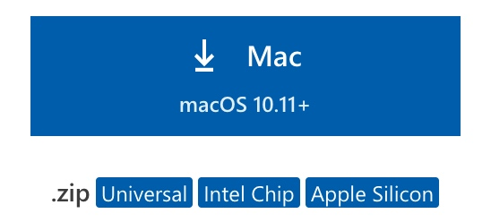
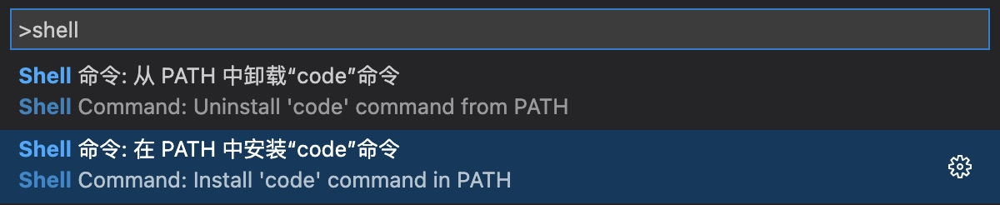
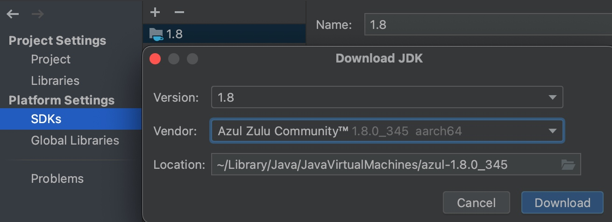

# Mac 开光指南（V2）
💻 一份新 macOS 快速食用方法，普适新 Mac 或重装系统。

> 本指南基于 MBP 14寸 12.5 系统（**主**）和 MBP 13寸 11.4 系统。
>
> 系统和软件的更新频繁，本项目不一定及时更新，故操作界面或步骤会略有差别，但影响不大。
>
> 本指南涉及内容较广，请选择适合自己的操作。
> 
> 请善用 TOC 目录导航内容，GitHub 中 `README.md` 左侧的按钮更方便。
>
> 本指南遵循许可协议 [CC BY-NC-ND 4.0](https://creativecommons.org/licenses/by-nc-nd/4.0/deed.zh)（请看[转载要求](https://shockerli.net/reprint-protocol)）
>
> 博客原文地址: https://shockerli.net/post/mac-initialize
>
> 长期更新地址: https://github.com/shockerli/mac-initialize
>
> 最后更新于 `2023-03-01`


## 应用安装
### 安装软件

### 软件下载途径
- App Store 搜索或排行榜
- 软件的官网，都会提供下载
- 第三方网站（不一定安全，需自行甄别）

有一些软件，是没有上架应用商店（如搜狗输入法）、或应用商店里的是阉割版本（如柠檬清理），就需要去官网下载。

下载软件时，尽量选择与架构匹配的，不要选 `Universal`，因为 `Universal` 会同时包含两个架构的软件包，体积更大但却没啥用。以下图 VSCode 为例，如果是 M1/M2 等苹果芯片则选 `Apple Silicon`，反之则选 `Intel Chip`。



当然，目前绝大多数的软件是不支持这么选择的，也就是只提供了一个 `Universal` 通用版本，那安装后，电脑里就会多一个架构的软件，可以使用[柠檬清理](https://lemon.qq.com)进行查找清理掉，不影响正常使用。


### 桌面上的安装包图标怎么去除？
- 方法①：桌面上右键安装包图标，选择「推出“XXX”」。


- 方法②：Finder（访达）左栏的「位置」处也有对应安装包，点按应用名称右侧的推出图标即可。

- 方法③：重启系统后，安装包镜像会自动取消，对应的图标也会自动消失。


### 关闭软件更新
为何要关闭软件更新？因为默认会自动下载更新，也就会偷偷跑流量，而苹果系统更新都是几个G起步。不信看看 `/Library/Updates` 目录有多大。

关闭自动更新：
- `系统偏好设置 → 软件更新 → 自动保持我的 Mac 运行最新版本（取消勾选）`
- `系统偏好设置 → 软件更新 → 高级... → 取消所有勾选`（主要是**下载可用的更新**）
- `App Store → 偏好设置 → 自动更新（取消勾选）、自动下载站其他设备上购买的App（取消勾选）`

删除已下载的文件：
- 关闭 `SIP`、删除目录 `/Library/Updates` 下的内容、再开启 `SIP`。

进程 `nsurlsessiond` 会偷偷跑流量，有几个原因：
- 正在下载系统或软件更新文件
- iCloud 正在同步数据


## 键盘符号与快捷键
### 符号映射
| 符号 | 按键 |
| --- | --- |
| ⌘ | Command |
| ⇧ | Shift |
| ⇪ | Caps Lock |
| ⌥ | Option = Alt |
| ⌃ | Control |
| Fn | 功能键 |
| ↩ | Enter |
| ⌫ | Delete |
| ⌦ | Fn + Delete |
| ↑ | 上箭头 |
| ↓ | 下箭头 |
| ← | 左箭头 |
| → | 右箭头 |
| ⇞ | Fn + ↑ = Page Up |
| ⇟ | Fn + ↓ = Page Down |
| Home | Fn + ← |
| End | Fn + → |
| ⇥ | Tab = 右制表符 |
| ⇤ | Shift + Tab = 左制表符 |
| ⎋ | Esc = Escape |
| ⏏ | 电源开关键 |
| ` | 反引号（ESC 下面） |


一定要熟记前 5 个符号的按键位置！！！


### 常用快捷键
大部分情况下，Command 键等同于 Windows 的 Ctrl 键，以下仅列出部分常用或与 Windows 不一样的快捷键，更多参考官方 [Mac 键盘快捷键](https://support.apple.com/zh-cn/HT201236) 以及对应软件的快捷键。

| 快捷键 | 说明 |
| --- | --- |
| Command + Z | 撤销，`Shift + Command + Z`：重做 |
| Command + 逗号 (`,`) | 打开当前窗口应用的**偏好设置** |
| Control + Command + Q | 立即锁定屏幕 |
| Command + D | 复制所选文件 |
| Option + Command + D | 显示或隐藏“程序坞” |
| Control + Command + D | 显示或隐藏所选字词的定义 |
| Control + A | 移至行或段落的开头 |
| Control + E | 移至行或段落的末尾 |
| Control + U | 终端软件里，直接清除行 |
| Control + 空格 | 切换输入法 |
| Command + Q | 退出当前应用 |

- 访达

| 快捷键 | 说明 |
| --- | --- |
| Command + 上箭头 | 打开包含当前文件夹的文件夹 |
| Command + 左中括号 (`[`) | 前往上一文件夹 |
| Command + 右中括号 (`]`) | 前往下一个文件夹 |
| Command + Delete | 将所选项移到废纸篓 |
| Option + Command + C | 复制当前目录的全路径 |

- 窗口

| 快捷键 | 说明 |
| --- | --- |
| Command + Tab | 在多个打开的 App 之间切换到**下一个**最近使用的 App |
| Command + Shift + Tab | 在多个打开的 App 之间切换到**上一个**最近使用的 App |
| Command + `（反引号） | 同一个应用的不同窗口间切换，已被最小化的窗口无法恢复 |
| Command + M | 最小化当前窗口，但无法通过快捷键切换回来，只能手动去菜单栏或程序坞重新打开 |
| Command + H | 隐藏当前应用，即该应用的所有窗口，可通过快捷键切换回来 |
| Command + Option + H | 隐藏其他应用 |
| F3 | 显示当前桌面的所有已打开窗口（不含最小化或已隐藏） |
| Control + 上箭头 | 同上 |
| 触控板：四指向上轻扫 | 同上（如已设置`触控板 → 更多手势 → 调度中心`） |
| Control + 下箭头 | 显示当前应用的所有已打开窗口（不含最小化或已隐藏） |
| 触控板：四指向下轻扫 | 同上（如已设置`触控板 → 更多手势 → App Expose`） |

- 桌面

| 快捷键 | 说明 |
| --- | --- |
| Control + 右箭头 | 向右切换桌面 |
| 触控板：四指向右轻扫 | 同上 |
| Control + 左箭头 | 向左切换桌面 |
| 触控板：四指向左轻扫 | 同上 |


其他快捷键：选取苹果菜单 > “系统偏好设置”，点按“键盘”，然后点按“快捷键”。


## 基础设置

### 触控板设置
触控板的设置及使用教程，可查看 `系统偏好设置 > 触控板`。

> 让你的触控板变的跟鼠标不同，治疗你的手指关节炎😄

- `系统偏好设置 > 触控板 > 光标与点按`
    * `轻点来点按（勾选）`
    * <u>可单指轻点=鼠标左键点击，可双指轻点=鼠标右键点击</u>

- `系统偏好设置 > 触控板 > 光标与点按`
    * `查询与数据检测器（勾选）`
    * `三指轻点`
    * <u>对着词汇三指轻点，直接调用Mac自带词典查询，与右键中的「查询」一样</u>

- `系统偏好设置 > 触控板 > 更多手势`
    * `App Expose（勾选）`
    * `在全屏幕显示的App之间轻扫（四指左右轻扫）`
    * <u>以上两个选项，将三指操作改为四指操作，是为了给「三指拖移」让路</u>

- `系统偏好设置 > 辅助功能 > 指针控制 > 鼠标与触控板 > 触控板选项`
    * `启动拖移（勾选）> 三指拖移`
    * <u>与鼠标左键按住拖动一样，三个手指同时在触控板滑动，可拖动任何窗口的菜单栏进行移动，也可以选择范围内容</u>

学习触控板设置中的各个手势操作示范视频，别再跟鼠标一样用触控板啦。


### 开启任何来源
为何要「任何来源」权限？因为不开启就无法安装 `App Store` 以外的软件，比如从网站直接下载的 dmg 安装包。

`被认可的开发者` 指的是购买了苹果企业证书对应用进行签名、且提交给苹果审核通过的软件。而大部分免费开源的应用是不会去购买此证书的。另外，破解应用因为会修改应用的文件从而导致签名失效而无法运行。所以，想安装第三方应用，需要开启 `任何来源` 这个权限。

`macOS` 默认隐藏了 `任何来源` 选项，需要在终端执行以下命令显示此选项：

```shell
sudo spctl --master-disable
```

然后在 `系统偏好设置 > 安全性与隐私 > 通用 > 任何来源` 打开：


### 修改主机名
> 就是为了好看点，默认的太丑，隔空投送的显示名字和终端都会用到

参考文章: https://shockerli.net/post/macos-hostname-scutil/

设置路径：`系统偏好设置 > 共享` => 修改`电脑名称`、编辑`本地主机名`

也可通过命令修改：

```shell
# 修改主机名
sudo scutil --set HostName 自定义主机名

# 修改电脑名称
sudo scutil --set ComputerName 自定义电脑名
```


### 拼写辅助
当你输入英文单词时，默认会提示你更正首字母为大写，烦人的很。

`系统偏好设置 > 键盘 > 文本 > 自动大写字词的首字母（取消勾选）`

同理，如果不想「自动纠正拼写」或其他输入相关的功能，也可在此面板一并调整。


### 程序坞（Dock）


`程序坞(Dock)` 是 macOS 桌面上日常 APP 和功能的便利管理，与 `Windows` 任务栏类似。

`系统偏好设置 > 程序坞与菜单栏 > 程序坞`
    - `> 将窗口最小化至应用程序图标（勾选）`
    - `> 在程序坞中显示最近使用的应用程序（取消勾选）`


从程序坞中挨个移除你不行要的应用图标，以及添加你希望常驻的图标。

**移除**：`右键程序坞中应用图标 > 选项 > 从程序坞中移除`

或者将程序坞中的图标拖到废纸篓中也能删除图标。


**添加**：从启动台（应用全列表）拖动图标到程序坞指定位置


### 显示器

#### 夜览
夜览与 [f.lux](https://justgetflux.com) 功能类似，根据时间来自动调节显示器色温的护眼程序。不过系统自带夜览只支持内置显示器，外接显示器不会生效，此时可关闭夜览并使用 `f.lux`。

```
系统偏好设置 > 显示器 > 夜览... > 设定时间 > 日落到日出
```


### 菜单栏


菜单栏中的系统图标尽量少一点，多留空间给应用图标，尤其是小屏、刘海屏。

#### 时钟
默认时间格式太长，去除不必要的。

```
系统偏好设置 > 程序坞与菜单栏 > 时钟 > 显示日期（取消勾选）、显示星期（取消勾选）、在时间中显示秒钟（勾选）
```

#### 聚焦
不需要在菜单栏展示，有快捷键 `⌘ + 空格`。

```
系统偏好设置 > 程序坞与菜单栏 > 聚焦 > 在菜单栏中显示（取消勾选）
```

#### Siri
不需要在菜单栏展示，可配置快捷键或语音指令。

`系统偏好设置 > Siri`，自行配置「听取“嘿Siri”」、快捷键等。


### 访达（Finder）


`访达(Finder)` 是 macOS 中文件可视化管理程序。
- `访达 → 偏好设置 → 通用 → 开启新“访达”窗口时打开：「下载」`

    设置一个访达启动时的默认打开目录。

- `访达 → 偏好设置 → 通用 → 在标签页中打开文件夹（勾选）`

    开启多标签页功能。
    （旧版系统不支持，可自行安装 `Path Finder` 或 `TotalFinder` 以使用该功能）

- `访达 → 偏好设置 → 高级 → 执行搜索时：「搜索当前文件夹」`

    默认是搜全电脑文件，但绝大多数我们期望的是搜索当前文件夹下的文件。

- 开启 `退出访达` 功能

    一般都应用都能退出（`⌘ + Q`），但访达默认是不行的，需手动开启。
    
    ```shell
    defaults write com.apple.finder QuitMenuItem -bool true
    
    killall Finder
    ```

- 显示目录全路径

    `Finder` 顶栏默认显示的是当前目录的名称，如需跟 Windows 一样显示全路径，需手动开启。

    ```shell
    defaults write com.apple.finder _FXShowPosixPathInTitle -bool true
    
    killall Finder
    ```
    

### 服务
`服务` 是 macOS 中服务提供者程序为服务请求者程序提供的便捷服务（便捷入口、且支持设置快捷键）。

例如，`iTerm` 就在 `Finder`

```
系统偏好设置 → 键盘 → 快捷键 → 服务
```

可开启所需服务，及设置其快捷键。


### 密码长度限制
macOS 10.14 后不允许设置 4 位数以下的密码。下面的命令可关闭这个策略的限制：

```shell
pwpolicy -clearaccountpolicies
```


### 开机自启管理
用户级别的开机自启应用管理，可在 `系统偏好设置 → 用户与群组 → 登录项` 列表中查看和开关。

系统级别的，比如 `Docker`，可用 `柠檬清理` 等系统工具进行管理。

如果是通过 `Homebrew` 安装的服务，那可用 `brew services` 命令管理。

也可以通过命令 `launchctl` 进行管理。


### 关于 SIP
SIP（`System Integrity Protection`，系统完整性保护）是 macOS 所采用的一项安全技术，能够帮助防止潜在恶意软件修改 macOS 上受保护的文件和文件夹。系统完整性保护可以限制 `root` 用户帐户，以及 `root` 用户能够在 macOS 的受保护部分完成的操作。

为了安全，**强烈不建议**关闭 `SIP` 保护。

如果一个应用需要关闭 SIP 才可运行，这意味着此应用本身也不安全，可直接放弃。

如果是临时性的需要（如上文提到的删除系统更新文件），可以先关闭、操作完后再立即开启。


## 基础设施
### Xcode Command Line Tools
> macOS 系统很多软件都需要用到的依赖工具，不安装的话连 Git 都没法用🙄

```shell
xcode-select --install
```

同意协议后会全程自动下载安装，文件比较大，需要等待一会。


### Homebrew
开源免费、强大易用的软件安装管理器。

官网: https://brew.sh

GitHub: https://github.com/Homebrew/brew


因国内访问 GitHub 不稳定，可以直接参考清华大学镜像站的安装教程，简单快速、此处不做复述。

清华大学开源软件镜像站及安装、镜像教程: https://mirrors.tuna.tsinghua.edu.cn/help/homebrew/


### iTerm2
开源免费、美观高效的最强终端工具。

官网下载: https://www.iterm2.com

或 `brew install --cask iterm2`


#### 颜色配置
颜色列表: https://iterm2colorschemes.com

颜色选择: `Profiles -> Colors -> Color Presets` 选择 `Solarized Dark`


#### 背景图
`Profiles → Default → Window → Background Image → Enabled（勾选，会弹窗让选择图片`

还可调节透明度、缩放模式。


#### Profiles Command
`Profiles` 用于配置新建 Tab 的默认行为，而 `Profiles` 中的 Command 则可用于配置新建 Tab 时自动执行的命令，一般用于 SSH 远程连接的场景较多。

Profiles Command 配置：


注意：自定义的 Profile 会继承 `Default` 的配置，故自定义的 Profile 无需重复去配置颜色、主题、快捷键等。

Profiles 使用及快捷键：


#### Status Bar


#### 配置左右键前后单词跳转
> 按住 `option + → or ←` 键，在命令的开始和结尾跳转切换

`Profiles → Default → Keys → Key Mappings`，点击 `+`：

`Keyboard shortcut`: `option + →`
`Action`: `Send Escape Sequence`
`Esc + f`

`Keyboard shortcut`: `option + ←`
`Action`: `Send Escape Sequence`
`Esc + b`


#### iTerm2 快速隐藏和显示
`Keys → Hotkey`，勾选 `Show/hide all windows with a system-wide hotkey`，并设置快捷键，比如 `⌥ + ⌘ + .`（`option + command + 句点`）。


#### 在 Finder 中打开当前目录
在终端中使用 `open` 命令即可：
```shell
open .
```

#### 粘贴自动转义
从剪切板粘贴 URL 到 iTerm2 时会被转义。参考官方 [Wiki](https://github.com/ohmyzsh/ohmyzsh/wiki/Settings#disable_magic_functions)。打开配置文件 `~/.zshrc`：
```ini
DISABLE_MAGIC_FUNCTIONS=true
```

#### Finder 中使用 iTerm 打开当前目录
可在 Finder 中快捷的使用 iTerm 打开当前目录，避免手动的在 iTerm 中输入路径。

```
Finder → 文件右键 → 服务 → New iTerm2 Tab Here
```


### Oh My Zsh
`Oh My Zsh` 让 `zsh` 变得更好用、配置更简单。（macOS 10.15 后已使用 `zsh` 作为默认 Shell）

GitHub: https://github.com/ohmyzsh/ohmyzsh

- 通过`curl`安装

```shell
sh -c "$(curl -fsSL https://raw.githubusercontent.com/ohmyzsh/ohmyzsh/master/tools/install.sh)"
```

- 设置 `zsh` 为当前用户的默认 `Shell`

```shell
chsh -s /bin/zsh
```

- 配置文件

```shell
.zshenv 中存放的环境变量配置项在任何场景下都能被读取，这里通常把$PATH等变量写在这里，这样无论是在交互 shell，或者运行程序都会读取此文件

.zshrc 主要用在交互 shell，上篇文章中就是对这个文件进行修改。对终端交互shell有用。

.zlogin 在 login shell 的时候读取，比如系统启动的时候会读取此文件

.zprofile 是.zlogin的替代品，如果使用了 .zlogin 就不必再关心此文件

.zlogout退出终端的时候读取，用于做一些清理工作

读取顺序
.zshenv → [.zprofile if login] → [.zshrc if interactive] → [.zlogin if login] → [.zlogout sometimes]
```


#### 配置
- 禁用自动更新

    默认会每次新开 Tab 时检查更新，编辑 `~/.zshrc`，取消该行内容的注释：
    
    ```shell
    zstyle ':omz:update' mode disabled
    ```

#### 插件

##### zsh-autosuggestions
> 输入命令时可提示自动补全（灰色部分），按键 `→` 即可补全
> 
> https://github.com/zsh-users/zsh-autosuggestions

通过 Brew 安装：
```shell
brew install zsh-autosuggestions
```

安装完后，根据提示，打开 `~/.zshrc` 添加：
```shell
// 以下内容可能 Homebrew 版本不一样，以 brew 的提示为准
// 比如以前是 /usr/local/share/xxx
// 可直接用 brew info zsh-autosuggestions 查看
source /opt/homebrew/share/zsh-autosuggestions/zsh-autosuggestions.zsh
```


##### zsh-syntax-highlighting
> 日常用的命令会高亮显示，命令错误显示红色
> 
> https://github.com/zsh-users/zsh-syntax-highlighting

通过 Brew 安装：
```shell
brew install zsh-syntax-highlighting
```

安装完后，根据提示，打开 `~/.zshrc` 添加：
```shell
// 以下内容可能 Homebrew 版本不一样，以 brew 的提示为准
// 比如以前是 /usr/local/share/xxx
// 可直接用 brew info zsh-syntax-highlighting 查看
source /opt/homebrew/share/zsh-syntax-highlighting/zsh-syntax-highlighting.zsh
```

##### autojump
> 实现目录间快速跳转，想去哪个目录直接 `j + 目录名`
> 
> https://github.com/wting/autojump

通过 Brew 安装：
```shell
brew install autojump
```

安装完后，根据提示，打开 `~/.zshrc` 添加：
```shell
[ -f /opt/homebrew/etc/profile.d/autojump.sh ] && . /opt/homebrew/etc/profile.d/autojump.sh
```


#### 主题
主题列表: https://github.com/ohmyzsh/ohmyzsh/wiki/Themes

内置主题: `$ZSH/themes`（`$HOME/.oh-my-zsh/themes`）

修改 `~/.zshrc` 配置文件：

```shell
ZSH_THEME="robbyrussell"
```

可在 `$ZSH/custom/themes` 下自定义主题。


### Git
#### GitHub 配置 SSH
终端执行命令 `ssh-keygen`，一路回车，生成密钥。

读取并拷贝密钥文本。
```shell
cat ~/.ssh/id_rsa.pub
```

打开 [GitHub](https://github.com/settings/ssh/new) SSH key 配置页面（`个人头像 > Settings > Access > SSH and GPG keys > New SSH Key`），将拷贝的 `ssh-rsa` 密钥内容添加到 GitHub。


#### Git 配置 user
终端执行命令 `git config --global -e` 打开 Git 全局配置文件，修改或添加 `[user]` 内容：
```ini
[user]
    name = jioby
    email = jioby@example.com
```

或者使用命令行方式：
```shell
git config --global user.name "jioby"
git config --global user.email "jioby@example.com"
```


#### 设置 lg 别名
`git config --global -e` 打开配置文件：
```ini
[alias]
    lg = log --graph --pretty=format:'%Cred%h%Creset | %ad | %Cblue%d%Creset %s %Cgreen(%an)%Creset' --abbrev-commit --date=short
```

或者使用命令行方式：
```shell
git config --global alias.lg "log --graph --pretty=format:'%Cred%h%Creset | %ad | %Cblue%d%Creset %s %Cgreen(%an)%Creset' --abbrev-commit --date=short"
```

接着可使用 `git lg` 清爽看日志：
```shell
* 5864617 | 2022-07-31 |  (HEAD -> master, origin/master, origin/HEAD) update license to CC 4.0 (Jioby)
* 3d8de53 | 2022-07-31 |  关闭自动更新，解决nsurlsessiond偷偷跑流量 (shockerli)
* a0c313e | 2022-07-30 |  vscode install code command (shockerli)
* 8ebffa3 | 2022-07-30 |  全新指南，支持macOS 12.x系统 (shockerli)
```

#### 默认分支
设置 Git 项目初始化时的默认分支，一般为 `master` 或 `main`。

```shell
git config --global init.defaultBranch <name>
```


### Vim
在 macOS 上 `Vim` 使用较浅，故配置够用即可，不装扩展。直接 `vim ~/.vimrc`：

```vim
" 推荐设置
colorscheme desert  " 颜色显示方案
syntax on           " 打开语法高亮
set tabstop=4       " TAB 字符的显示宽度

" 以下自选
set nocompatible    " 不兼容 Vi
set nu              " 显示行号
set showmatch       " 自动高亮匹配括号
set cursorline      " 高亮光标所在行
set hlsearch        " 高亮搜索匹配结果
set incsearch       " 跟随输入，即时搜索
set ignorecase      " 搜索忽略大小写
set history=1000    " 历史操作记录次数
set autoread        " 文件发生外部变更时提示
set wildmenu        " 命令模式，底部按 Tab 自动补全
set smartindent     " 智能缩进
set expandtab       " 按 Tab 键时，使用空格替代制表符（不影响已有制表符）
set shiftwidth=4    " 自动缩进时，缩进长度
set softtabstop=-1  " Tab 转为多少空格，负数表示与shiftwidth一致
set laststatus=2    " 是否显示状态栏, 0:不显示, 1:多窗口时显示, 2:显示
set ruler           " 这状态栏显示光标的当前位置（行数&列数）
set wrap            " 自动换行
```

`colorscheme` 可选项在 `/usr/share/vim/vim*/colors` 目录下，自己选。


## 系统工具

### 柠檬清理
> 腾讯出品**开源免费**的清理、卸载、流量、监控、磁盘空间分析、开机启动管理等系统工具。

官网下载: https://lemon.qq.com

开源地址: https://github.com/Tencent/lemon-cleaner

最值得使用的功能，莫过于**清理与当前芯片不同版本的二进制文件**：


### 输入法
拼音输入法推荐 `搜狗输入法`，简单易用、词库齐全、安装即用。

官网下载: https://pinyin.sogou.com/mac/

输入法配置：`系统偏好设置 > 键盘 > 输入法`：删除无用的输入法（`ABC` 别删）

同步原配置：`偏好设置 > 登录账户 > 同步 > 配置同步 > 下载配置`


### Chrome
官网下载: https://www.google.cn/intl/zh-CN/chrome/

#### 扩展
- [Infinity New Tab Pro](http://cn.infinitynewtab.com): 新标签页
- [iTab New Tab](https://www.itab.link): 新标签页
- [FeHelper](https://www.baidufe.com/fehelper): 前端工具集（内含 JSON 美化对比、时间转换、编码转换等十几个小工具）
- [Adblock Plus](https://adblockplus.org): 广告净化
- [SimpRead](http://ksria.com/simpread): 最佳阅读体验
- [Tampermonkey](https://www.tampermonkey.net): 油猴脚本管理
- [ImageAssistant](http://www.pullywood.com/ImageAssistant): 图片助手，网页图片提取下载
- [SourceGraph](https://sourcegraph.com): GitHub 源码浏览神器


#### 油猴脚本
油猴脚本（用户脚本）是一段代码，它们能够优化您的网页浏览体验。安装之后，有些脚本能为网站添加新的功能，有些能使网站的界面更加易用，有些则能隐藏网站上烦人的部分内容。

[Tampermonkey](https://www.tampermonkey.net) 是一个可运行在 Chrome、Firefox、Safari、Edge 等浏览器的用户脚本管理扩展。

[Greasy Fork](https://greasyfork.org) 则是一个油猴脚本免费商店，绝大部分用户脚本都在上面有发布，方便查找、安装使用。

**安装方式**：
- 从 Greasy Fork 安装
    例如 [CSDNGreener](https://greasyfork.org/zh-CN/scripts/378351)，打开后会显示安装按钮和界面
- 从 URL 安装
    例如 Bilibili-Evolved 的脚本 URL 是 https://raw.githubusercontent.com/the1812/Bilibili-Evolved/master/dist/bilibili-evolved.user.js
    直接在 Tampermonkey `管理面板 > 实用工具 > 从 URL 安装`，粘贴脚本 URL，点击安装即可

**推荐脚本**：
- [Bilibili-Evolved](https://github.com/the1812/Bilibili-Evolved) - B站增强 [[脚本 URL]](https://raw.githubusercontent.com/the1812/Bilibili-Evolved/master/dist/bilibili-evolved.user.js)
- [CSDNGreener](https://github.com/adlered/CSDNGreener) - CSDN 网站绿化 [[Greasy Fork]](https://greasyfork.org/zh-CN/scripts/378351)


### Alfred
效率工具神器，可以快速的搜索本地应用、搜索本地文件、执行终端命令、浏览器搜索、打开网址、剪切板管理、翻译、文件管理、音乐控制等，也可以自定义工作流，与其他软件深度配合。

软件小巧、性能强悍、高级功能需付费，配置同步可用 iCloud 或 Git 或自己想办法。

官网: https://www.alfredapp.com

#### 常用配置
- `Features` > `Web Search` > 新增自定义搜索、关闭不需要的搜索
- `Features` > `Default Results` > `Setup fallback results` > 设置使用搜索方式
- `Features` > `Clipboard History` > 勾选需要剪贴板存储的内容（文本、图片、文件）及保留时间
- `Appearance` > 选择 `Alfred macOS` 切换主题样式，也可以自定义
- `Appearance` > `Options` > `Show Alfred on`：选择 `active screen` 或 `mouse screen`，因为默认为 `default screen` 即在默认显示屏打开 Alfred 窗口，多屏或多显示器时默认设置不够贴心。

#### Workflows
可参考下面两个收藏集合内的配置：
- [learn-anything/alfred-workflows](https://github.com/learn-anything/alfred-workflows)
- [zenorocha/alfred-workflows](https://github.com/zenorocha/alfred-workflows)


### Shell Alias
以下是常用命令，设置别名，使用更方便。添加到 `~/.zshrc`。
```shell
alias ll='ls -Alh'
alias al='ls | sed "s:^:`pwd`/:"'
alias egrep='ps -ef | grep'
alias grep='grep --color=auto --exclude-dir={.bzr,CVS,.git,.hg,.svn}'
```


### autossh
> 一个简单管理远程 SSH 账号的脚本工具

- 安装
```shell
curl -o /usr/local/bin/autossh https://raw.githubusercontent.com/FeeiCN/autossh/master/autossh
chmod +x /usr/local/bin/autossh
```

- 配置
```shell
$ cat ~/.autosshrc
server_name|192.168.1.110|root|password|port|is_bastion
```

### 开发软件
- `SourceTree`: Git 可视化（免费）
- `Navicat Premium`: 多种数据库管理工具
- `Sourcetrail`: 源码阅读神器（[开源](https://github.com/CoatiSoftware/Sourcetrail)）
- `Jetbrains IDE 系列`
- `Postman`: 接口调试（免费）([免费](https://github.com/JianLin-Li/Postman-cn))
- `htop`: 增强版 `top` 命令（[开源](https://github.com/htop-dev/htop)）
- `Visual Studio Code`: 强大的编辑器（[开源](https://code.visualstudio.com)）
- `Proxyman`: 代理抓包工具（免费）
- `OmniGraffle Pro`:强大的图形工具([免费](https://xclient.info/s/omnigraffle.html#versions))


#### Visual Studio Code
官网下载: https://code.visualstudio.com


##### 配置终端 code 快捷打开
安装 `code` 命令，支持在终端快捷打开 `VSCode`。

快捷键 `⌘ + ⇧ + P` 打开命令面板，输入 `shell`，选择 `Shell Command: Install 'code' command in PATH`。



然后在终端输入 `code .` 或者 `code [path]` 直接在 `VSCode` 打开文件或目录。


##### 扩展
| 扩展 | 说明 |
| --- | --- |
| `Chinese Language Pack for Visual Studio Code` | 中文语言包 | 
| `IntelliJ IDEA Keybindings` | IntelliJ IDEA 快捷键绑定 |
| `Code Runner` | 快捷运行代码文件 |
| `EditorConfig for VS Code` | `EditorConfig` 配置扩展，根据配置统一格式化风格 |
| `PPZ` | 关系型数据库图形管理 |


#### Sublime Text
安装 `Package Control`: https://packagecontrol.io/installation

中文插件: `ChineseLocalizations`

- 配置 `subl` 命令行打开文件

> 在 `~/.zshrc` 添加如下配置:

```shell
alias subl="'/Applications/Sublime Text.app/Contents/SharedSupport/bin/subl'"
```

然后就可以使用 `subl [path]` 快捷打开文件或目录。


### 其他软件
- [`f.lux`](https://justgetflux.com)：自动调整屏幕色温的护眼程序（免费）
- `MonitorControl`：[`开源`](https://github.com/MonitorControl/MonitorControl) 显示器亮度、音量控制，支持外接显示器
- `万年历`：日历（免费）
- `网易有道词典`：翻译（免费）
- `iShot`：截图、长截图、录屏（基础免费）
- `嘀嗒清单`：时间与日程管理（基础免费）
- `MWeb` / `Typora` / `FSNotes`：Markdown 笔记管理
- `FastZip/MacZip`：解压缩（免费）
- `NTFS Disk by Omi`：免费的 NTFS 磁盘读写管理器（支持 M1）
- `OmniGraffle Pro`：图表/流程图等矢量图绘制
- `Reeder`：RSS 订阅
- `IINA`：[`开源`](https://github.com/iina/iina)音视频播放器
- `Beyond Compare`：文件/文本对比
- `Rectangle` - [`开源`](https://github.com/rxhanson/Rectangle)窗口整理/分屏
- `uTools`：类似 Alfred 的效率工具，跨平台（免费）
- `Brave Browser`：基于 `Chromium` 的[`开源`](https://github.com/brave/brave-browser)浏览器，号称能更好的保护隐私
- `Bitwarden`：[`开源`](https://github.com/bitwarden/clients) 密码管理器
- `Maccy`：[`开源`](https://github.com/p0deje/Maccy)剪切板管理工具
- [`FlyKey`](https://www.better365.cn/FlyKey.html) - 应用快捷键展示（免费）
- `Parallels Desktop` - 虚拟机
- AlDente - 电源管理，让电池更耐用（基础免费）

还有很多优秀软件没有推荐，后续单开一个专门介绍。


## 开发环境

### Java
#### JDK
- `JVM`：`Java Virtual Machine`
- `JRE`：`Java Runtime Environment`
- `JDK`：`Java SE Development Kit`
- `SDK`：`Software Development Kit`

```
  ┌─    ┌──────────────────────────────────┐
  │     │     Compiler, debugger, etc.     │
  │     └──────────────────────────────────┘
 JDK ┌─ ┌──────────────────────────────────┐
  │  │  │                                  │
  │ JRE │      JVM + Runtime Library       │
  │  │  │                                  │
  └─ └─ └──────────────────────────────────┘
        ┌───────┐┌───────┐┌───────┐┌───────┐
        │Windows││ Linux ││ macOS ││others │
        └───────┘└───────┘└───────┘└───────┘

图源自：https://www.liaoxuefeng.com/wiki/1252599548343744/1255876875896416
```

##### OracleJDK
> 仅 JDK 17 及以上版本才支持 Apple Silicon。
> 
> JDK 8 需登录 Oracle 账户才能下载，且没有 ARM 版本。（虽然 x64 版本也可以安装使用，但不清楚是否存在问题）
> 
> 不是很推荐使用 OracleJDK，因为其协议已改为 [OTN](https://www.oracle.com/java/technologies/javase/jdk-faqs.html)

下载地址: https://www.oracle.com/java/technologies/downloads

根据 CPU 选择包：
- **Intel**: `x64 DMG Installer`
- **Apple Silicon**: `Arm 64 DMG Installer`

下载安装，然后验证：
```shell
➜  ~ java -version
java version "1.8.0_311"
Java(TM) SE Runtime Environment (build 1.8.0_311-b11)
Java HotSpot(TM) 64-Bit Server VM (build 25.311-b11, mixed mode)
```

配置 `JAVA_HOME` 环境变量：
```shell
export JAVA_HOME=/Library/Java/JavaVirtualMachines/jdk1.8.0_311.jdk/Contents/Home
```

##### OpenJDK
OpenJDK 是 Sun 在 2006 年开源的 Java SE 免费开源版本，采用 `GPLv2+CE` 许可协议。该项目由 Oracle 主导，IBM、红帽、微软等均有参与。

官网: https://openjdk.org

- Homebrew 安装
```shell
// 搜索
brew search openjdk

// 安装
// 苹果芯片不一定支持老版本，失败则可考虑安装 Zulu 版本
brew install openjdk@8

// 配置
sudo ln -sfn /opt/homebrew/opt/openjdk@8/libexec/openjdk.jdk /Library/Java/JavaVirtualMachines/openjdk-8.jdk
```

- Zulu 安装

下载对应版本: https://www.azul.com/downloads/?version=java-8-lts&os=macos&architecture=arm-64-bit&package=jdk

对应的安装教程: https://docs.azul.com/core/zulu-openjdk/install/macos

```shell
➜ java -version
openjdk version "1.8.0_342"
OpenJDK Runtime Environment (Zulu 8.64.0.15-CA-macos-aarch64) (build 1.8.0_342-b07)
OpenJDK 64-Bit Server VM (Zulu 8.64.0.15-CA-macos-aarch64) (build 25.342-b07, mixed mode)
```

对应的 `JAVA_HOME` 在 `/Library/Java/JavaVirtualMachines/zulu-8.jdk/Contents/Home`


##### SDKMAN
一个专门安装、管理 SKD 的跨平台 Shell 脚本软件，支持几乎所有厂商的 JDK 及常用 SDK。

官网及教程: https://sdkman.io

以 JDK 为例，其他 SDK 类似。

- 安装 SDKMAN

```shell
curl -s "https://get.sdkman.io" | bash
source "$HOME/.sdkman/bin/sdkman-init.sh"
```

安装目录 `$HOME/.sdkman`

- 查看支持的 JDK 版本列表

```shell

================================================================================
Available Java Versions for macOS ARM 64bit
================================================================================
 Vendor        | Use | Version      | Dist    | Status     | Identifier
--------------------------------------------------------------------------------
 Java.net      |     | 20.ea.9      | open    |            | 20.ea.9-open
               |     | 20.ea.8      | open    |            | 20.ea.8-open
               |     | 19.ea.34     | open    |            | 19.ea.34-open
               |     | 19.ea.33     | open    |            | 19.ea.33-open
               |     | 18.0.2       | open    |            | 18.0.2-open
               |     | 18.0.1.1     | open    |            | 18.0.1.1-open
 Microsoft     |     | 17.0.4       | ms      |            | 17.0.4-ms
               |     | 17.0.3       | ms      |            | 17.0.3-ms
               |     | 11.0.16      | ms      |            | 11.0.16-ms
               |     | 11.0.15      | ms      |            | 11.0.15-ms
 Oracle        |     | 18.0.2       | oracle  |            | 18.0.2-oracle
               |     | 18.0.1       | oracle  |            | 18.0.1-oracle
               |     | 17.0.4       | oracle  |            | 17.0.4-oracle
               |     | 17.0.3       | oracle  |            | 17.0.3-oracle
```


- 安装 JDK

```shell
// OracleJDK
sdk install java x.y.z-oracle

// OpenJDK
sdk install java x.y.z-open
```

- 查看切换默认 JDK 版本

```shell
// 查看当前版本
sdk current java

// 切换默认版本
sdk default java x.y.z-open
```

##### IDEA
`IntelliJ IDEA` 提供了 JDK 管理功能，可添加已存在的 JDK，也可代为下载安装所需 JDK。

操作步骤：`MenuBar` → `File` → `Project Structure...`(`⌘ + ;`) → `SDKs` → `+` → `Download JDK`




##### JAVA_HOME
查看已安装版本的 `JAVA_HOME`：
```shell
/usr/libexec/java_home

/Library/Java/JavaVirtualMachines/zulu-8.jdk/Contents/Home
/Library/Java/JavaVirtualMachines/zulu-11.jdk/Contents/Home
```

查看指定版本的 `JAVA_HOME`：
```shell
/usr/libexec/java_home -v8

/Library/Java/JavaVirtualMachines/zulu-8.jdk/Contents/Home
```

单个版本配置（`~/.zshrc`）：
```shell
export JAVA_HOME=$(/usr/libexec/java_home -v8)
```

多版本配置：
```shell
# Java Home
export JAVA_HOME=$(/usr/libexec/java_home -v11)
export JAVA_8_HOME=$(/usr/libexec/java_home -v8)
export JAVA_11_HOME=$(/usr/libexec/java_home -v11)

alias java8='export JAVA_HOME=$JAVA_8_HOME'
alias java11='export JAVA_HOME=$JAVA_11_HOME'

# 默认为 Java 8
java8
```


#### Maven
- 安装

```shell
brew install maven
```

> 如果只使用 `IDEA`，可无需安装，直接使用 IDE 内置的 Maven 即可。

- 国内镜像配置

以 [阿里云 Maven](https://developer.aliyun.com/mvn/guide) 为例。打开或创建配置文件：`$HOME/.m2/settings.xml`，并修改：

```xml
<?xml version="1.0" encoding="UTF-8"?>
<settings xmlns="http://maven.apache.org/SETTINGS/1.0.0"
          xmlns:xsi="http://www.w3.org/2001/XMLSchema-instance"
          xsi:schemaLocation="http://maven.apache.org/SETTINGS/1.0.0 http://maven.apache.org/xsd/settings-1.0.0.xsd">
    <mirrors>
        <mirror>
            <!-- 文档: https://developer.aliyun.com/mvn/guide -->
            <id>aliyunmaven</id>
            <mirrorOf>*</mirrorOf>
            <name>阿里云公共仓库</name>
            <url>https://maven.aliyun.com/repository/public</url>
        </mirror>
    </mirrors>
</settings>
```


### PHP
#### 安装

- 第三方源
> 由于官方维护的 PHP 版本都是最新的几个，对于比较老的版本，无法直接安装，如果需要可 Tap 第三方源

强烈推荐: [shivammathur/php](https://github.com/shivammathur/homebrew-php)

> 添加 Tap
```shell
brew tap shivammathur/php
```

- 安装 PHP

> 此处示例安装 `PHP 7.4`
```shell
brew install php@7.4
```

> 将此版本替换为命令行默认版本
```shell
brew link --overwrite --force php@7.4
```

> 添加到 PATH
```shell
echo 'export PATH="/opt/homebrew/opt/php@7.4/bin:$PATH"' >> ~/.zshrc
echo 'export PATH="/opt/homebrew/opt/php@7.4/sbin:$PATH"' >> ~/.zshrc
```

- 配置

> 打开配置文件修改默认时区
```ini
date.timezone = PRC
```


#### Composer
- 安装

通过 brew 安装：
```shell
brew install composer
```

或者手动安装：
```shell
curl -o composer https://getcomposer.org/download/latest-stable/composer.phar
chmod +x composer
[ ! -d "/usr/local/bin" ] && sudo mkdir /usr/local/bin
sudo mv composer /usr/local/bin
```

- 降级

如果一些老项目不支持 Composer V2，那么需要回退到 V1 版本
```shell
composer self-update --1
```

- 镜像
```shell
// 设置镜像
composer config -g repo.packagist composer [mirrors-url]

// 取消镜像
composer config -g --unset repos.packagist
```

```
// 阿里云
官网: https://developer.aliyun.com/composer
镜像: https://mirrors.aliyun.com/composer/

// 腾讯云
// 出现过composer.lock文件中dist.reference与dist.url下载不一致的情况
// 即reference是最新commit，但镜像url下载的包却不非最新
官网: https://mirrors.cloud.tencent.com/help/composer.html
镜像: https://mirrors.cloud.tencent.com/composer/
```

其他镜像不是很稳定、或不是很全（一些下载量小的会 `404`），如有问题，轮换着试试。


### Go
#### 安装
安装最新版本
```shell
brew install go
```

或者指定版本
```shell
brew install go@1.13
```

非最新版本，需要建立个链接，这样才能用到 Go 命令
```shell
brew link --overwrite --force go@1.13
```


#### 配置
- 环境变量

```shell
export GO111MODULE=on
export GOPATH=/Users/jioby/gowork
export PATH="$GOPATH/bin:$PATH"
export GOPROXY=https://goproxy.cn,https://goproxy.io,direct
export GOPRIVATE=*.your-private-git.com
```

- 私有仓库

终端运行命令 `git config --global -e`，添加如下类似配置并保持：
```shell
[url "ssh://git@git.example.com:8182/"]
        insteadOf = https://git.example.com/
```


